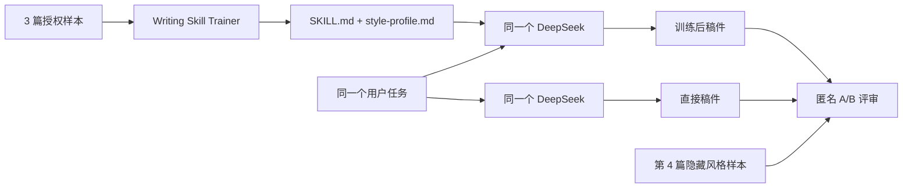

<div align="center">

<h1>Writing Skill Trainer</h1>
<p><strong>让同一个模型从你的样本学习，训练出可复用、可检查的 Writing Skill。</strong></p>
<p>DeepSeek 直接生成 vs. 从样本训练 Skill 后生成</p>

</div>

| 训练后盲评偏好 | 直接生成盲评偏好 | 来源重合警报 | DeepSeek 调用 |
|---:|---:|---:|---:|
| **7/9** | **2/9** | **0/18** | **30 calls / 104,300 tokens** |

> [!IMPORTANT]
> `7/9` 是匿名写作质量偏好，不是最终通过率。加入长度、事实和复制检查后，训练后胜 3、直接胜 2、双方均未通过 4。失败结果没有隐藏。

## 快速查看

| Demo | 样本 | 匿名偏好 | 硬约束后 | 固定代表稿 | DeepSeek 生成的 Skill |
|---|---:|---:|---:|---|---|
| [《红楼梦》章回体续写](demos/red-chamber/) | 3 + 1 留出 | 训练后 3:0 直接 | 训 2 / 直 1 / 均失败 0 | [直接稿](demos/red-chamber/outputs/repetition-1-direct.md) · [训练后稿](demos/red-chamber/outputs/repetition-1-trained.md) | [Skill bundle](demos/red-chamber/skill/) |
| [冷峻讽刺小说](demos/restrained-satire/) | 3 + 1 留出 | 训练后 2:1 直接 | 训 1 / 直 1 / 均失败 1 | [直接稿](demos/restrained-satire/outputs/repetition-1-direct.md) · [训练后稿](demos/restrained-satire/outputs/repetition-1-trained.md) | [Skill bundle](demos/restrained-satire/skill/) |
| [中性科技新闻报道](demos/tech-news/) | 3 + 1 留出 | 训练后 2:1 直接 | 训 0 / 直 0 / 均失败 3 | [直接稿](demos/tech-news/outputs/repetition-1-direct.md) · [训练后稿](demos/tech-news/outputs/repetition-1-trained.md) | [Skill bundle](demos/tech-news/skill/) |

完整导航：[`demos/`](demos/) · 完整长文：[`SHOWCASE.md`](SHOWCASE.md) · 原始数据：[`results/benchmark.json`](results/benchmark.json) · 本地视觉页：[`index.html`](index.html)

## 对比的是什么



两组使用完全相同的用户提示、模型、temperature 和 max_tokens。唯一差异是训练后组加载了 DeepSeek 从样本生成的运行时 Skill bundle。

## 三个 Demo

### 1. 《红楼梦》章回体续写

- 公版文学样本；训练后三轮匿名评审全胜。
- 一轮训练后稿件因超长被硬约束反转，说明风格提升不等于任务必然合格。
- [查看完整 Demo](demos/red-chamber/) · [查看生成 Skill](demos/red-chamber/skill/)

### 2. 冷峻讽刺小说

- 使用鲁迅公版作品展示“从细节、叙述距离和反差中学习机制”，不宣传复刻在世作者。
- 训练后匿名偏好 2:1，但长度稳定性仍有问题。
- [查看完整 Demo](demos/restrained-satire/) · [查看生成 Skill](demos/restrained-satire/skill/)

### 3. 中性科技新闻

- 中文维基新闻 CC BY 2.5 样本；训练后稿件事实约束优于直接稿。
- 两组均未满足全部硬约束，因此不能包装成成功案例。
- [查看完整 Demo](demos/tech-news/) · [查看生成 Skill](demos/tech-news/skill/)

## 生成的 Skill Demo

每个 Demo 都提供可直接浏览的完整目录：

```text
demos/<scenario>/skill/
├── README.md
├── SKILL.md
└── references/
    └── style-profile.md
```

这些是 DeepSeek 在该次 benchmark 中实际生成并实际加载的文件，不是事后手写的示意稿。它们属于 benchmark 候选产物，正式使用前仍应人工复核。

## 实验方法

1. 每类 3 篇训练样本，另留 1 篇不参与训练的风格样本。
2. 每类保留 3 轮结果，固定第 1 轮作为公开代表稿，不按输赢挑样。
3. 生成顺序交替；评审前随机映射 A/B 身份。
4. DeepSeek 负责训练、两组生成和匿名评审；程序检查长度与连续来源重合。
5. 请求模型为 `deepseek-chat`；API 实际返回 `deepseek-v4-flash`。

> [!WARNING]
> DeepSeek 同时担任生成器和评审，不等同于独立人类偏好研究。新闻 Demo 暴露了当前版本的长度控制缺陷。对外发布前仍需人工评审。

## 复现

Python 3.10+，不依赖第三方包：

```bash
cp marketing/writing-skill-trainer/.env.example .env.local
# 在被 gitignore 的 .env.local 中填写 DEEPSEEK_API_KEY

python3 marketing/writing-skill-trainer/prepare_sources.py
python3 marketing/writing-skill-trainer/run_benchmark.py --run-id my-run --repetitions 3
python3 marketing/writing-skill-trainer/render_showcase.py marketing/writing-skill-trainer/runs/my-run
```

## 来源与边界

- 《红楼梦》与鲁迅作品：公版。
- 中文维基新闻：CC BY 2.5，逐条链接与哈希见各 Demo 和 benchmark JSON。
- 不使用在世作者姓名宣传“风格复刻”；个人风格案例应使用用户拥有或明确获授权的样本。

Run: `deepseek-launch-final-20260812` · Completed: `2026-08-12T09:13:37.651544+00:00`
